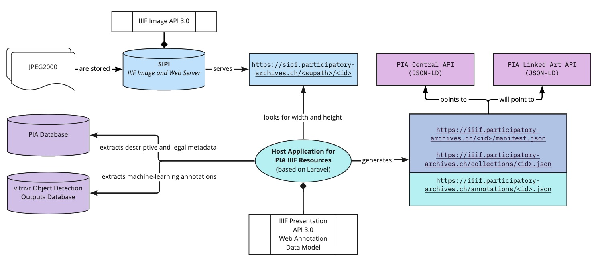

<!-- _class: lead -->

# <!-- fit --> Linked Art at PIA
[Julien A. Raemy](https://julsraemy.ch) | PhD Candidate in DH, University of Basel
02.11.2022 | Linked Art WG Call

<!-- This presentation is about the deployment of Linked Art within the PIA research project  -->

--- 

<!-- footer: 'Julien A. Raemy | Linked Art at PIA' -->

# PhD Working Title

***Linked Open Usable Data in the Humanities***: *Perspectives on Knowledge Representation and Interoperability*

[PhD Website](https://phd.julsraemy.ch)

<!-- It is grounded as part of the Participatory Knowledge Practices in Analogue and Digital Image Archives (PIA) research project, which aims to develop a Citizen Science platform around three photographic collections of the Swiss Society for Folklore Studies (SSFS). The theoretical framework of the thesis is situated through and beyond an Actor-Network Theory (ANT) lens.  -->

--- 

# Agenda

- Participatory Knowledge Practices in Analogue and Digital Image Archives (PIA)
- PIA goes LOUD
- Linked Art
- Collaboration with the Linked Art II project
- Future Work

--- 

<!-- _class: lead -->

# <!-- fit --> PIA

---

# PIA Teams

- **Cultural Anthropology**: Institute for Cultural Anthropology and European Ethnology, University of Basel
- **Technology**: Digital Humanities Lab, University of Basel
- **Design**: Bern Academy of the Arts, Bern University of Applied Sciences

[Project Website](https://about.participatory-archives.ch/) 

<!-- PIA is a Sinergia project funded by the Swiss National Science Foundation (SNSF) led by the University of Basel, the Uni, the Bern Academy of the Arts, and the Swiss Society for Folklore Studies. PIA wants to connect the world of data and things in an interdisciplinary manner. 

We explore the phases of the analogue and digital archive from the perspectives of cultural anthropology, technology and design. The common goal of this project is to design a visual interface with machine learning-based tools to make it easy to annotate, contextualize, organize, and link both images and their meta-information, to deliberately encourage the participatory use of archives. -->

---

### Collections of the Swiss Society for Fokflore Studies (SSFS) within PIA

- **SGV_05 Atlas der Schweizerischen Volkskunde** - Cartography
- **SGV_10 Familie Kreis** - Vernacular Photography
- **SGV_10 Familie Kreis** - Photojournalism

https://archiv.sgv-sstp.ch 

---

### PIA User interface

[Prototype based on Omeka S](https://participatory-archives.ch/) 

--- 

<!-- _class: lead -->

# <!-- fit --> PIA goes LOUD

---

### Why do we need Linked Art at PIA?

- Data reconciliation
- Event-based model inherited from CIDOC-CRM
- Being part of a community of developers/scholars
- Potential aggregation capabilities
- Additional (LOUD) access point

---

<!-- _footer: " " -->

---

<!-- _footer: " " -->

<!-- IIIF Workflow within PIA -->

---

### Web Annotation Data Model

---

### Web Annotation Data Model

---

<!-- _class: lead -->

# <!-- fit --> Linked Art

---

### First serialisation attempts

---

<!-- _footer: " " -->

<!-- Linked Art and IIIF -->

---

# Linked Art
#### Something else

---

<!-- _class: lead -->

# Collaboration with the Linked Art II Project

---

### Something else

---

### What has been done

---

### Something else

---

### Workflow

https://github.com/tgra/Linked-Art-Collection-Data-Workflow 

---

<!-- _class: lead -->

# <!-- fit --> Future Work

---

### Endpoints

1. Deployment of the PIA Linked Art API at https://data.participatory-archives.ch. The PIA JSON API will be deprecated, but still accessible (at https://json.participatory-archives.ch)
2. Workflow Source: PIA JSON API → 
    - Omeka S API (JSON-LD) *or* 
    - DaSCH Service Platform API (JSON-LD, Turtle, RDF/XML)

---

### Templates 

- Updating and creating new boilerplates for each top-level entity
- Generic vs specific: another workflow? Software?

---

# Image Credits
- [Blick auf das Spalentor]. Basel, 1938. Ernst Brunner. SGV_12N_00115. 
- [Katze auf einer Mauer]. Ort und Datum unbekannt. Ernst Brunner. SGV_12N_19553
- ["Steffenbach-Brücke" der Furka-Bahn: Bau und Erneuern der Brücke]. Kanton Wallis, 1950. Ernst Brunner. SGV_12N_36937

All these images are part of the [photographic archives of the Swiss Society for Folfklore Studies](https://archiv.sgv-sstp.ch/). Licence: [CC-BY-NC 4.0](https://creativecommons.org/licenses/by-nc/4.0/legalcode)